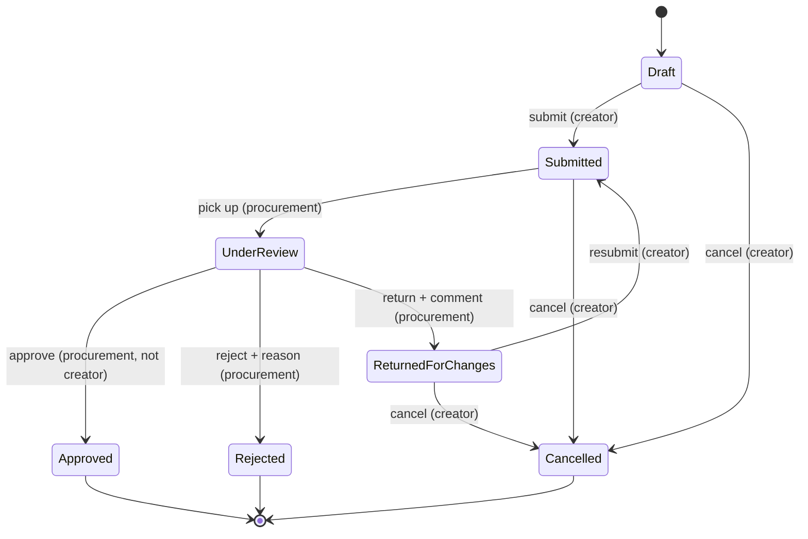

# API_AND_WORKFLOWS

**Status:** Planned design. This MVC app's "API surface" is its controller actions and Ajax endpoints; each is documented here **as it is built**, with route, verb, authorization, inputs, validation, responses, and error behavior.

## Documentation format (per action/endpoint)

```
Action:        POST /VendorRequests/{id}/Approve
Type:          Ajax (JSON) | Form POST | GET page
Authorization: Procurement Officer, Administrator
Input:         id (route), comment (body), anti-forgery token
Validation:    request must exist; status must be Under Review; reviewer ≠ creator
Success:       JSON { ok: true, newStatus: "Approved" } (Ajax) / redirect (form)
Failure:       400 + field errors | 403 | 404; UI shows error state
Side effects:  status history row; vendor created/activated; audit fields
```

## Application Workflows (planned)

### Vendor Registration Request — status machine (Phase 5)



Rules (enforced in the workflow service, tested in xUnit, **not** only in the UI):

- Only transitions on the diagram are legal; anything else returns a business error.
- Every transition writes a `RequestStatusHistory` row (who, when, from→to, comment).
- Reject requires a reason; Return requires a comment.
- Approve creates/activates the Vendor inside the same transaction.
- A user cannot review or approve their own request.

### CRUD module flows (Phases 2 & 4)

Standard per module (Departments, Employees, Vendors, Projects): list (GET, searchable) → details (GET) → create (GET form + POST) → edit (GET form + POST) → deactivate (POST). Validation and authorization per module documented as built.

### Assignment flows (Phase 4)

Assign employee/vendor to project: validates active status of both sides, date sanity, and uniqueness (DB constraint + service check). Duplicate attempt returns a field-level error, not an exception page.

## Ajax Endpoints (Phase 6 — documented as built)

Planned: approve/reject actions returning JSON; dependent dropdown data (`GET /Employees/ByDepartment?departmentId=`); paginated/filtered list partials. All Ajax POSTs carry the anti-forgery token.

## Error Behavior Conventions

- Validation failure: form redisplayed with field errors (form POST) or 400 + error map (Ajax)
- Not found: 404 page / 404 JSON
- Forbidden: 403 (never silently redirect Ajax to the login HTML page — return 401/403 so the client JS can react)
- Unexpected: generic error page / 500 JSON; details in logs only
