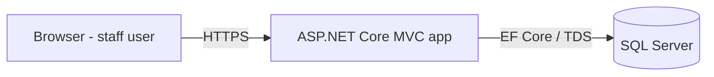
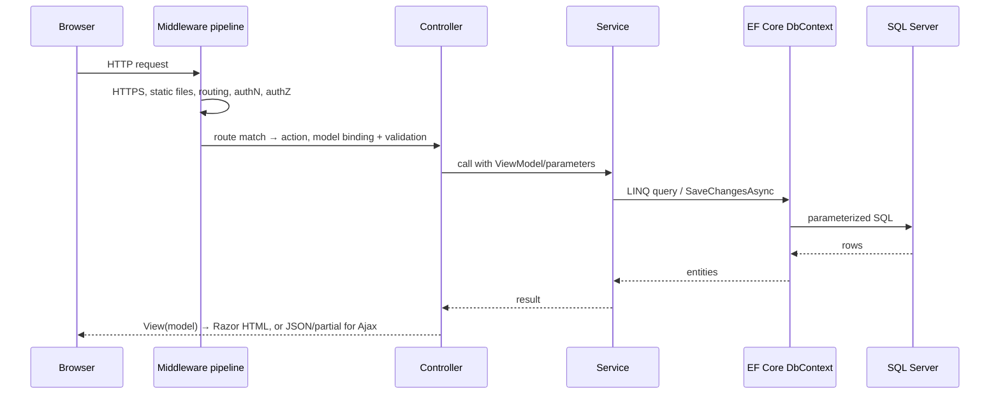

# ARCHITECTURE

**Status:** Proposed (no application code exists yet). Sections marked *(to be confirmed in Phase N)* will be validated against real code as it is built.

## System Purpose

Simulate the internal software of a fictional EPC (Engineering, Procurement, Construction) company: projects, departments, employees, vendors, assignments, and an approval workflow for business requests — with role-based access and audit history.

## System Context

- **Users:** internal staff of the fictional company, via browser.
- **System:** one ASP.NET Core MVC web application.
- **Data store:** one SQL Server database.
- **External systems:** none (deliberately — keeps the learning surface focused).



## User Roles

Administrator · Project Manager · Procurement Officer · General Employee. (Engineer and Finance Reviewer from the original brief were folded into these four to keep the authorization matrix learnable; see DECISIONS.md #003.)

## Chosen Structure: Single Web Project + Test Project

```
src/
  EpcVendorManagement.Web/
    Program.cs              app startup, DI registrations, middleware pipeline
    Controllers/            thin HTTP controllers
    Models/
      Entities/             EF Core entities (domain data)
      Enums/                statuses, categories
    ViewModels/             per-screen/per-form models with validation attributes
    Services/               business logic (interfaces + implementations)
    Data/                   DbContext, migrations, seed data
    Views/                  Razor views, layout, partials
    wwwroot/                css, js (jQuery), bootstrap, images
tests/
  EpcVendorManagement.Tests/  xUnit unit + integration tests
```

### Why not a 4-project clean architecture?

Considered: `Web / Core / Application / Infrastructure`. Rejected **for now** (DECISIONS.md #001) because:

- The owner is relearning C#; four projects add navigation and reference friction without teaching more MVC/EF/SQL — the interview-relevant material.
- Machine tests are single-project builds; practicing the single-project shape has direct interview value.
- Separation of concerns is achieved *within* the project via folders + interfaces + DI. Services depend on abstractions and are unit-testable without extra assemblies.
- The structure can evolve: because logic already lives in `Services/` behind interfaces, extracting class libraries later is mechanical, not a rewrite.

Trade-off accepted: less enforced layering (nothing physically stops a controller referencing `DbContext`). Mitigation: architecture rules in AGENTS.md/CLAUDE.md and code review.

## Layer Responsibilities

| Layer | Owns | Must not |
|---|---|---|
| Controllers | routing targets, model binding, calling services, choosing views/redirects, HTTP status | contain business rules or LINQ-to-DB |
| ViewModels | screen/form shape, validation attributes | leak into the database |
| Services | business rules, workflow transitions, queries via DbContext, transactions | know about HTTP |
| Entities | persisted shape, relationships | contain presentation logic |
| Views/partials | rendering ViewModels | query data or decide rules |

## Request Lifecycle (MVC) *(to be confirmed in Phase 2)*



Middleware order in `Program.cs` matters and will be documented against the real file: exception handling → HSTS/HTTPS → static files → routing → authentication → authorization → endpoints.

## Authentication Flow (Phase 3)

ASP.NET Core Identity, **cookie-based** (not JWT — this is a server-rendered MVC app; contrast with the owner's Django+JWT SPA experience). Login validates credentials → Identity issues an encrypted auth cookie containing the claims principal → each request's authentication middleware reconstructs `User` from the cookie.

## Authorization Flow (Phase 3)

Role-based via `[Authorize(Roles = "...")]` on controllers/actions; navigation menus additionally hide inaccessible links (convenience, not security — the server check is authoritative). Policy-based authorization only if a rule outgrows roles (e.g., "reviewer cannot approve own request" may become a policy or a service-level rule; decision deferred to Phase 5).

## Database Access

- EF Core code-first with migrations; SQL Server provider.
- Async queries on request paths; `Include` for known navigations; projection to ViewModels for lists to avoid over-fetching.
- EF Core already implements unit-of-work (DbContext) and repository-like access (DbSet) — no custom repository layer by default (DECISIONS.md #001).
- Transactions: explicit only for multi-step workflow operations (Phase 5); otherwise `SaveChangesAsync` is the transaction.

## Error-Handling Strategy

- Global exception handler middleware → friendly error page; details only in logs.
- Expected business failures (invalid transition, duplicate assignment) are results/validation errors, not exceptions.
- 404/403 pages user-friendly; no stack traces to users in any environment configuration that could be public.

## Logging Strategy

Built-in `ILogger<T>` with structured messages; EF Core SQL logging enabled in Development for query inspection (a Phase 7 learning tool). Never log secrets or personal data.

## Service Dependencies

All services registered in DI (`Program.cs`) as interfaces → implementations, scoped lifetime by default (matches DbContext). Controllers receive services via constructor injection.

## Deployment Direction

Local → Docker Compose (app + SQL Server) in Phase 8 → Azure App Service + Azure SQL fundamentals in Phase 9 (deployment optional; knowledge mandatory).

## Future Architecture Improvements (candidates, not commitments)

- Extract `Application`/`Infrastructure` class libraries if the Web project exceeds comfortable size
- Domain events for audit/notifications
- Caching for dashboard queries
- ViewComponents for repeated widgets (pending-approvals card)
