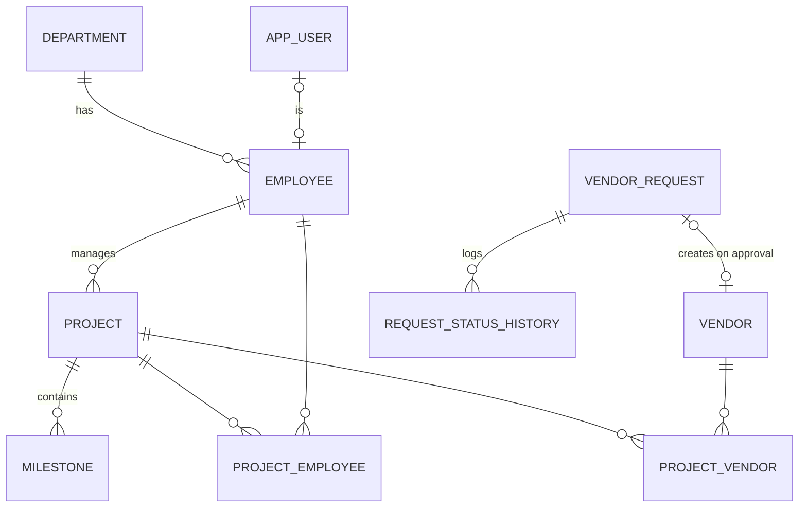

# DATABASE

**Status:** Planned design. No database exists yet — this is the target model; it will be built incrementally via EF Core migrations (first table in Phase 2) and this file updated to match reality at each step.

## Purpose

One SQL Server database holding the EPC domain: organizational structure (departments, employees), external parties (vendors), work (projects, milestones, assignments), workflow (vendor requests + history), and Identity's user/role tables.

## Planned Entities

| Entity | Phase | Purpose |
|---|---|---|
| Department | 2 | organizational unit; simplest entity, first CRUD |
| ApplicationUser / Roles (Identity) | 3 | login accounts, roles, claims |
| Employee | 4 | staff profile: code, designation, contact, status, department |
| Vendor | 4 | supplier profile: code, category, contact, active/approval status |
| Project | 4 | code, name, fictional client, dates, budget, status, manager |
| Milestone | 4 | project milestones with due dates and status |
| ProjectEmployee | 4 | join entity: employee↔project assignment + dates + responsibility |
| ProjectVendor | 4 | join entity: vendor↔project assignment |
| VendorRequest | 5 | vendor registration request in the approval workflow |
| RequestStatusHistory | 5 | every status transition: who, when, from→to, comment |

All business entities inherit audit fields: `CreatedBy`, `CreatedAt`, `ModifiedBy`, `ModifiedAt` (set centrally in the DbContext — Phase 3).

## Planned Relationships

- Department **1—∞** Employee
- ApplicationUser **1—0..1** Employee (an account may map to a staff profile)
- Employee(manager) **1—∞** Project
- Project **1—∞** Milestone
- Project **∞—∞** Employee via ProjectEmployee (composite/unique key blocks duplicate assignment)
- Project **∞—∞** Vendor via ProjectVendor
- VendorRequest **1—∞** RequestStatusHistory; VendorRequest **0..1—1** Vendor (created on approval)

## Planned ER Diagram

## Keys, Constraints, Indexes (design intent)

- **PKs:** identity `int` surrogate keys (simple, index-friendly; GUIDs not needed here).
- **Unique constraints:** Department.Name; Employee.EmployeeCode; Vendor.VendorCode; Project.ProjectCode; (ProjectId, EmployeeId) on ProjectEmployee; (ProjectId, VendorId) on ProjectVendor. Uniqueness is enforced in the database, not only in service code.
- **FKs:** all relationships above; deletes are **Restrict** by default — rows are deactivated (`IsActive`), not deleted, to preserve audit history.
- **Indexes:** FK columns; status columns used by dashboard filters (added in Phase 7 after inspecting real queries — not speculatively).
- **Nullability:** deliberate per column; e.g. `ActualEndDate` nullable, `StartDate` not.

## Normalization Notes

Target is 3NF for the core model. Deliberate, documented denormalization only if a real query need appears (none expected at this scale).

## Migration Strategy

Code-first EF Core migrations, one per schema change, descriptive names, never edit an applied migration. Command reference lives in SETUP.md.

## Seed Data Strategy

- Roles + dev-only demo users (Phase 3)
- A realistic fictional dataset: ~4 departments, ~12 employees, ~8 vendors, ~5 projects with assignments and requests in varied statuses (Phase 4) — enough for search/pagination/dashboard to be meaningful.

## Transactions

Single `SaveChangesAsync` = one transaction (EF default). Explicit transactions for workflow approval (Phase 5): status change + history row + vendor creation must succeed or fail together.

## SQL Practice Questions (answer with both LINQ and raw SQL as modules are built)

1. All active projects with their project manager's name (JOIN)
2. Count of vendors per category (GROUP BY)
3. Requests awaiting approval, oldest first (WHERE + ORDER BY)
4. Employees not assigned to any project (LEFT JOIN ... IS NULL / NOT EXISTS)
5. Projects ending within the next 30 days (date arithmetic)
6. Projects with their assigned vendors (multi-join through the join table)
7. Duplicate vendor names, if any (GROUP BY ... HAVING COUNT > 1)
8. Requests approved between two dates with reviewer name (JOIN on history)

## Useful Queries

*Populated with real, tested queries as tables are created.*
